 

 

---

## 👋 About Me

## Interests

 

---

## Skills

&nbsp;

<table align="center">
<tr>
<td align="center" width="50%" style="background-color:#141E30; border-radius:8px;">

</td>
<td align="center" width="50%">

</td>
</tr>
</table>

---

## Contributions

 

<picture>
  <source media="(prefers-color-scheme: dark)" srcset="https://raw.githubusercontent.com/daniyal-asim/daniyal-asim/output/github-contribution-grid-snake-dark.svg">
  <source media="(prefers-color-scheme: light)" srcset="https://raw.githubusercontent.com/daniyal-asim/daniyal-asim/output/github-contribution-grid-snake.svg">

</picture>

---

## GitHub Stats

 

 

---

## Connect

---

 

 

